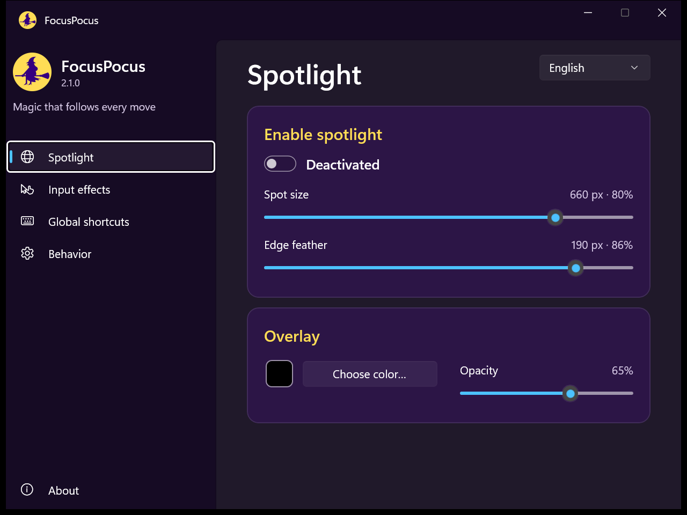
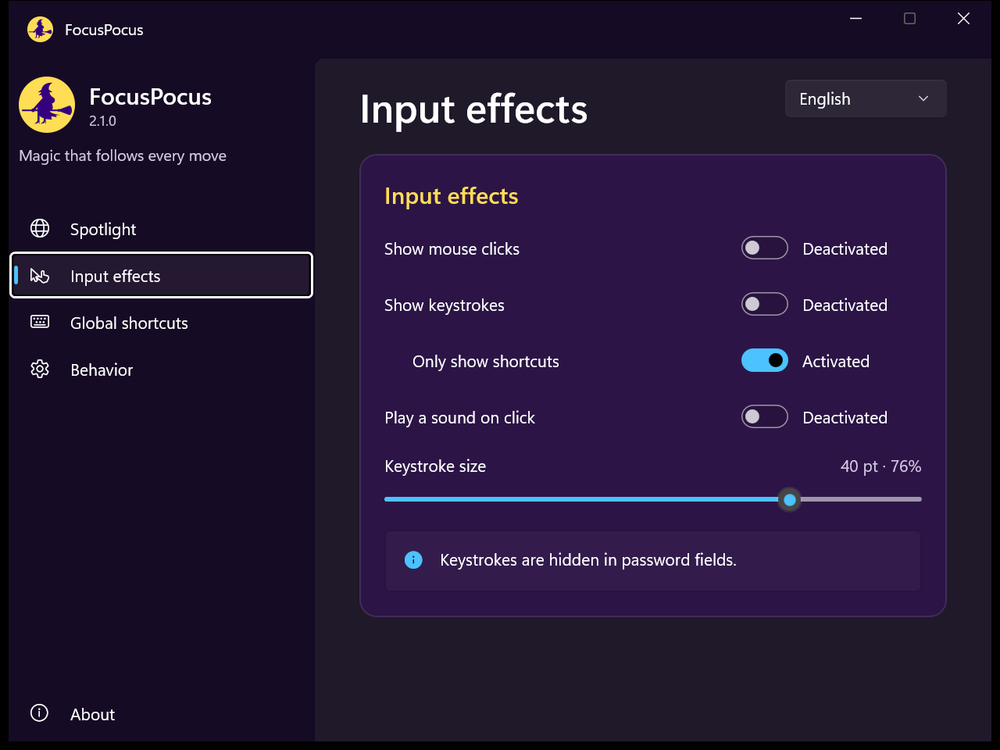
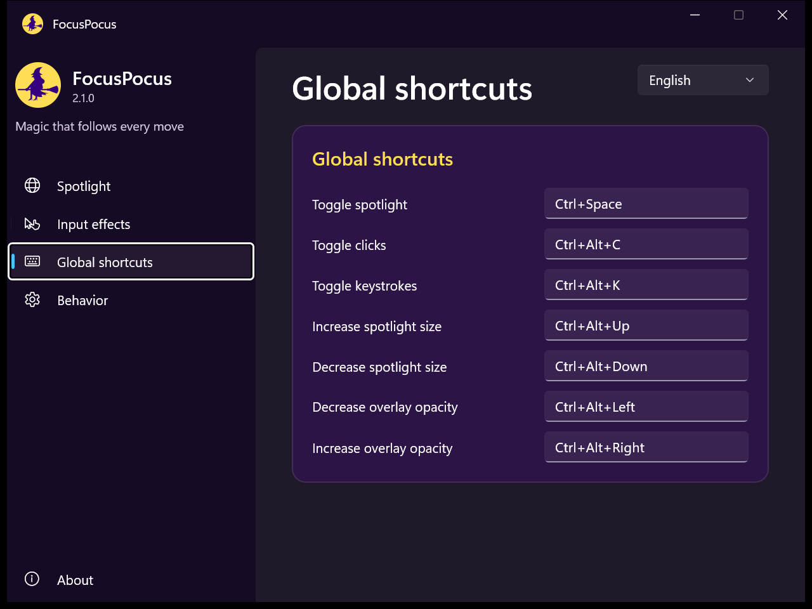
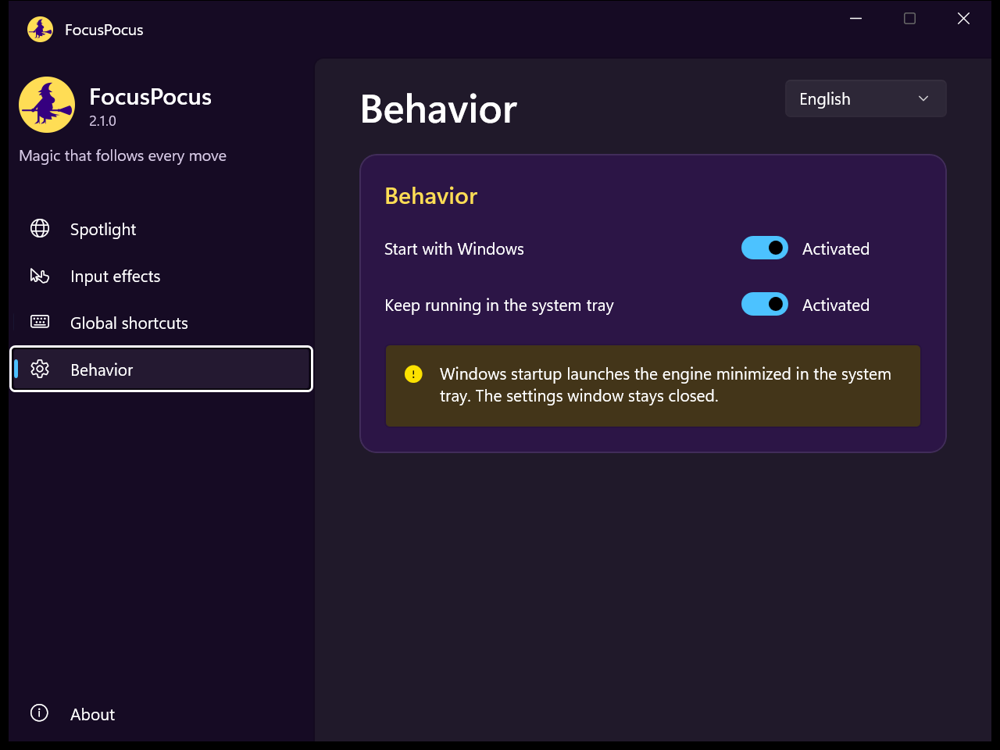
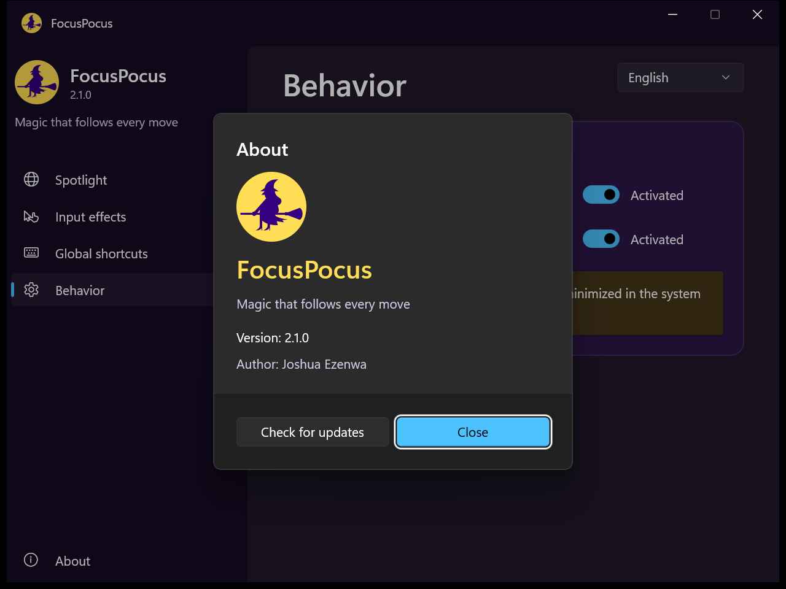
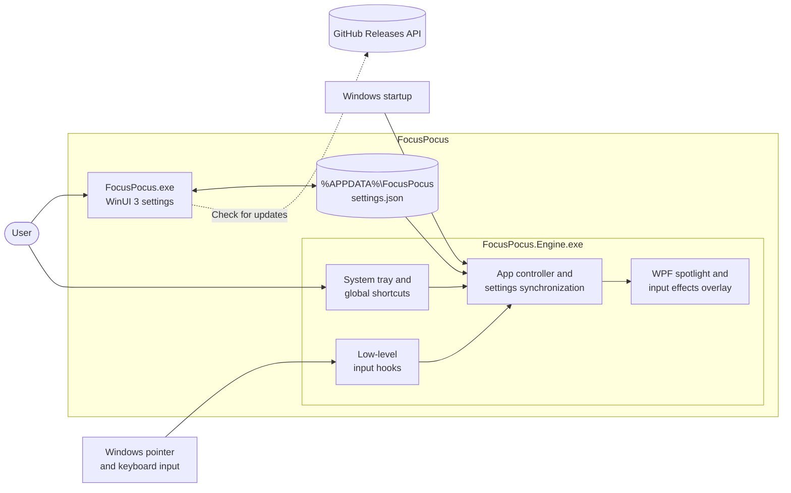

<p align="center">
  
</p>

<p align="center">
  A modern Windows 11 utility that spotlights the pointer, visualizes clicks, and displays keyboard shortcuts.
</p>

<p align="center">
  <a href="https://github.com/ezenwa/FocusPocus/releases/latest"><strong>Download latest release</strong></a>
  · <a href="docs/README.es.md">Español</a>
  · <a href="CHANGELOG.md">Changelog</a>
</p>

## Preview

<p align="center">
  
  
</p>
<p align="center">
  
  
</p>
<p align="center">
  
</p>

## Features

- Pointer spotlight with adjustable diameter up to 800 px and edge feathering.
- Smooth multi-monitor transitions.
- Custom overlay color and opacity.
- Mouse click visualization and optional click sound.
- Keystroke visualization with a shortcuts-only mode and password-field protection.
- Global shortcuts for spotlight, clicks, keystrokes, spotlight size, and overlay opacity.
- Native WinUI 3 settings experience with Mica and Windows 11 controls.
- Starts with Windows in the system tray without opening the settings window.
- Built-in update checker backed by GitHub Releases.
- Spanish and English interface.

## Default shortcuts

| Action | Shortcut |
|---|---|
| Toggle spotlight | `Ctrl+Space` |
| Toggle clicks | `Ctrl+Alt+C` |
| Toggle keystrokes | `Ctrl+Alt+K` |
| Increase spotlight size | `Ctrl+Alt+Up` |
| Decrease spotlight size | `Ctrl+Alt+Down` |
| Decrease overlay opacity | `Ctrl+Alt+Left` |
| Increase overlay opacity | `Ctrl+Alt+Right` |

## Requirements

- Windows 10 version 1809 or later; Windows 11 is recommended.
- 64-bit Windows.
- .NET 8 Desktop Runtime.

The installer includes the Windows App SDK runtime files required by the WinUI 3 interface.

## Install

1. Open the [latest release](https://github.com/ezenwa/FocusPocus/releases/latest).
2. Download `FocusPocus-Setup-<version>.exe`.
3. Run the installer and launch FocusPocus.

Windows SmartScreen may display a warning because community builds are not code-signed yet. Verify that the installer comes from this repository's Releases page.

## Architecture

FocusPocus uses two cooperating processes:

- `FocusPocus.exe`: the native WinUI 3 settings interface.
- `FocusPocus.Engine.exe`: the lightweight WPF overlay, input hooks, global shortcuts, and system-tray process.

This split lets Windows startup launch only the engine in the tray while the settings window stays closed.



## Build from source

Prerequisites:

- .NET 8 SDK
- Inno Setup 6 (only needed for the installer)

```powershell
git clone https://github.com/ezenwa/FocusPocus.git
cd FocusPocus
dotnet build .\src\FocusPocus.UI\FocusPocus.UI.csproj -c Release
dotnet build .\src\FocusPocus.Engine\FocusPocus.Engine.csproj -c Release
```

To create the installer:

```powershell
.\build.ps1
```

The installer is written to `dist`.

## Privacy

FocusPocus processes pointer and keyboard events locally. It does not transmit captured input. Keystrokes are not displayed while a standard Windows password field has focus. The update checker only requests public release metadata from the GitHub API when the user presses the update button.

## Contributing

See [CONTRIBUTING.md](CONTRIBUTING.md). Security issues should follow [SECURITY.md](SECURITY.md).

## License

FocusPocus is available under the [MIT License](LICENSE).
